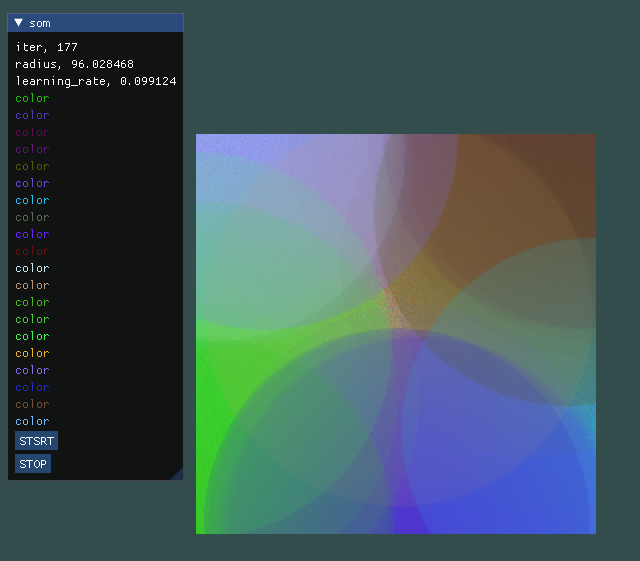

# Self-Organizing Map Color Demo

###### 第一次嘗試SOM ######

### 初始化
* lattice是200 * 200隨機生成的亂數顏色
* inputdata也是隨機生成的20種顏色
* 總迭代次數為20000
* 畫面
    * 左邊顯示目前的迭代次數、收縮半徑、學習比率
    * 顯示所有input color
    * 有按鈕開始即暫停
    
	

### 開始執行
	

### 結果

